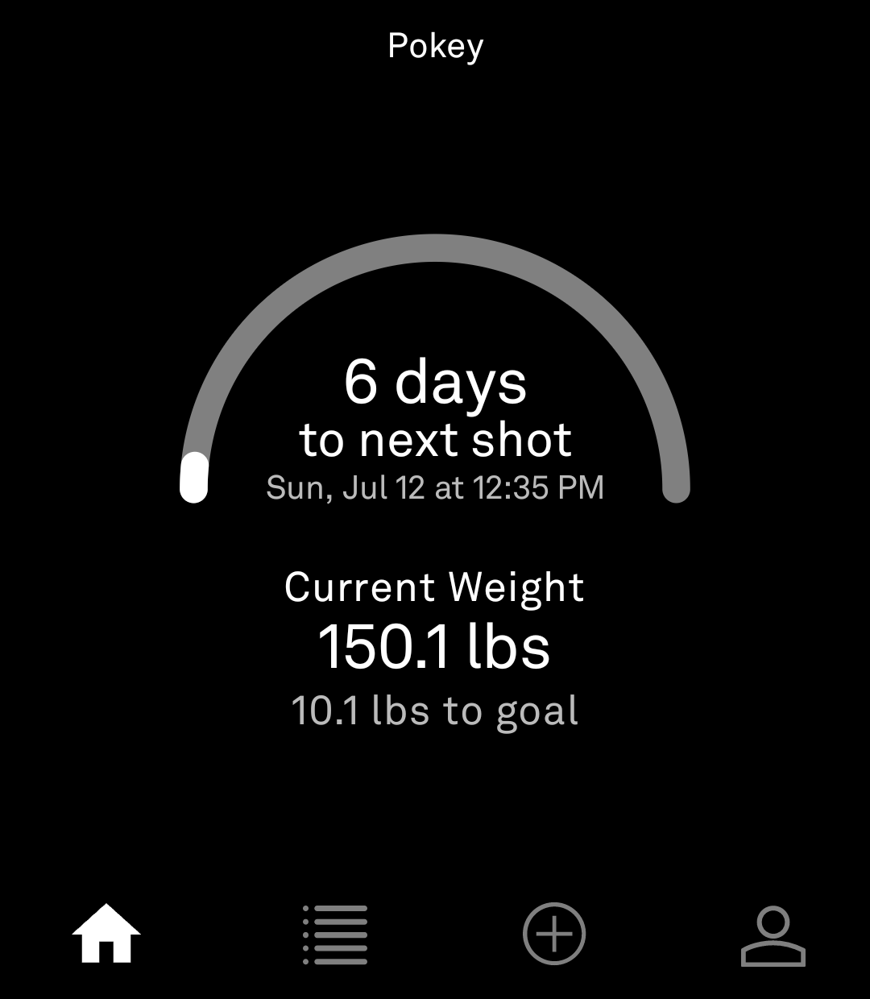
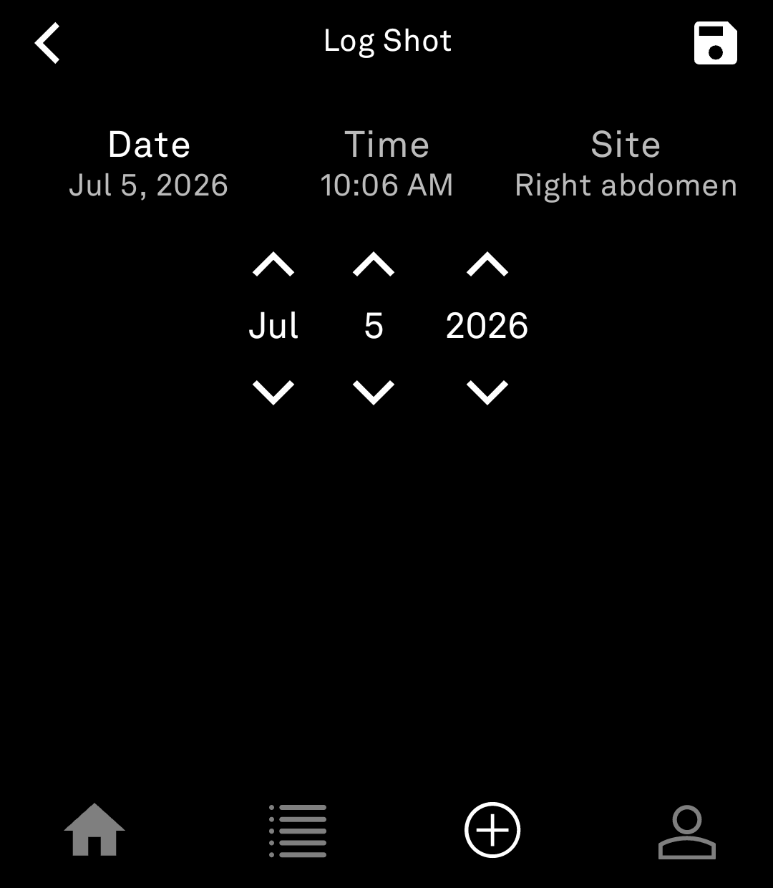
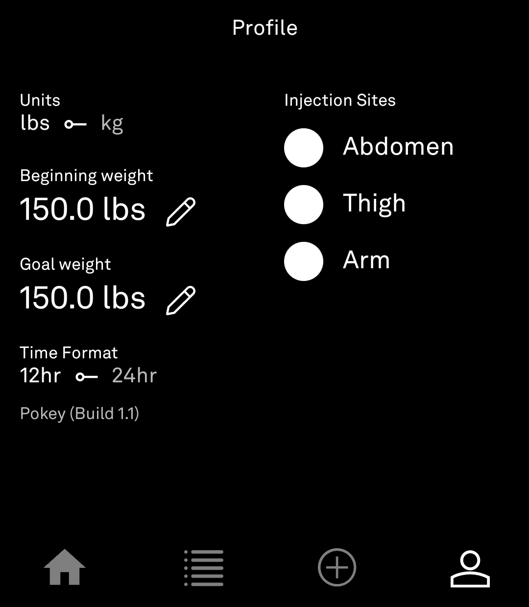

# Pokey

A personal GLP-1 injection and weight tracker for the Light Phone III.

Pokey keeps things simple: log a shot, log a weight, see how you're trending toward
your goal, and get reminded when the next shot is due. No accounts, no cloud sync,
no ads — everything lives on-device.

## Installing

The latest .apk file is available in [releases](../../releases).

I recommend using [Obtainium](https://github.com/ImranR98/Obtainium) and adding
the repository's URL to receive updates.

## Screenshots

| Home | Log Shot | Profile |
|---|---|---|
|  |  |  |

## Features

- **Shot logging** — date, time, and injection site, with the next site suggested
  automatically (cycling through sites so you're not reusing the same spot back to
  back).
- **Weight logging** — defaults to your last logged weight so re-entry is quick.
- **7-day countdown** — a gauge on Home counts down to your next shot, then
  switches to how overdue it is until you log a new one.
- **Editable history** — tap any past entry to correct or delete it.
- **Goal tracking** — set a beginning and goal weight in Profile; Home shows how far
  you are from goal.
- **lbs/kg and 12hr/24hr toggles** — pick your preferred units and time format once
  in Profile; every screen respects it.

## Building from source

This repo is a fork of [Light's tool SDK](https://github.com/lightphone/light-sdk).
Pokey's source lives entirely under [`tool/`](tool). To build it yourself:

1. Clone this repo and open it in Android Studio.
2. Follow the SDK's [Quickstart](https://github.com/lightphone/light-sdk#quickstart)
   for setting up a GitHub Packages token and an emulator.
3. `./gradlew :tool:assembleDebug` (or run the `tool` configuration from Android
   Studio).

For everything else about the underlying SDK — architecture, permissions, tool
metadata, the emulator — see [Light's original documentation](docs/).

## License

MIT, inherited from [Light's SDK](LICENSE).
